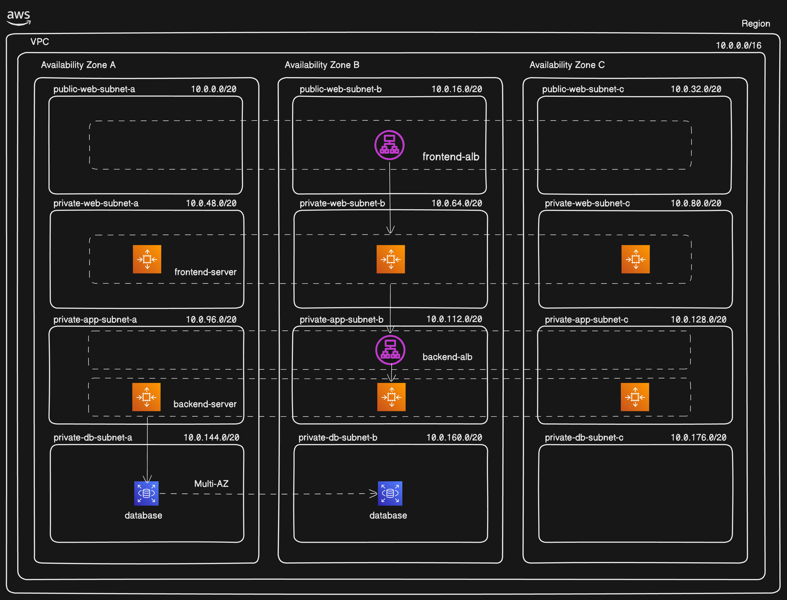

# Hello World Three-Tier Application

This repository contains a simple "Hello World" application built using a three-tier architecture. The application demonstrates the fundamental concepts of separating frontend, backend, and database components in a web application.

## Architecture Overview



The application follows the classic three-tier architecture:

1. **Frontend Tier (Presentation Layer)**
   - HTML/CSS/JavaScript
   - Served by NGINX web servers
   - Handles user interface and interactions

2. **Backend Tier (Application Layer)**
   - PHP API
   - Processes business logic
   - Communicates with database
   - Serves data to frontend

3. **Database Tier (Data Layer)**
   - MySQL database
   - Stores application data
   - Provides data persistence

## Features

- Display messages from the database
- Add new messages to the database
- Basic responsive design

## AWS Infrastructure Components

When deployed on AWS, the infrastructure includes:

- **Web ALB**: Load balancer for distributing traffic to web servers
- **NGINX Servers**: EC2 instances in an auto-scaling group
- **App ALB**: Load balancer for distributing traffic to application servers
- **PHP Servers**: EC2 instances in an auto-scaling group
- **RDS MySQL**: Managed relational database service

## Directory Structure

```
three-tier-architecture-aws/
├── frontend/
│   ├── index.html            # Main HTML file
│   ├── styles.css            # CSS styles
│
├── backend/
│   └── api/                  # API endpoints
│       ├── get_messages.php  # API to retrieve messages
│       ├── save_message.php  # API to save new messages
│       └── db_connection.php # Database connection utility
│
├── database/
│   └── database_setup.sql    # SQL schema and initial data
│
└── infrastructure/           # AWS infrastructure configurations
    ├── frontend_server.md     # Frontend server configurations
    ├── backend_server.md     # Backend server configurations
    ├── nginx_config     # Nginx server configurations
```

## Local Setup

### Prerequisites

- Web server with PHP support (XAMPP, WAMP, MAMP, etc.)
- MySQL database

### Steps

1. **Database Setup**:
   - Create a MySQL database named `hello_world`
   - Import `database/database_setup.sql` to create the schema and initial data

2. **Backend Setup**:
   - Copy the contents of the `backend` directory to your app server
   - Update database connection details in `api/db_connection.php`

3. **Frontend Setup**:
   - Copy the contents of the `frontend` directory to your web server

## Development

### Frontend Development

The frontend is built with plain HTML, CSS, and JavaScript. It uses the Fetch API to communicate with the backend.

To make changes to the frontend:
1. Modify the HTML/CSS/JavaScript files in the `frontend` directory
2. Test the changes locally

### Backend Development

The PHP backend provides simple API endpoints for retrieving and saving messages.

To make changes to the backend:
1. Modify the PHP files in the `backend/api` directory
2. Test the changes locally

## Security Considerations

This is a demo application and lacks several security features that would be necessary in a production environment:

- Input validation and sanitization
- Authentication and authorization
- HTTPS encryption
- Protection against SQL injection (although PDO with prepared statements is used)
- CORS configuration

## License

This project is released under the MIT License.

## Acknowledgements

This sample application was created as a demonstration of AWS three-tier architecture principles.